# COIS-2430H: Winter 2024 — Assignment 3 Part 1 Testing

## Testing Overview

- **Cross-browser and Cross-platform Testing**: The website was tested on multiple browsers 
- Chrome  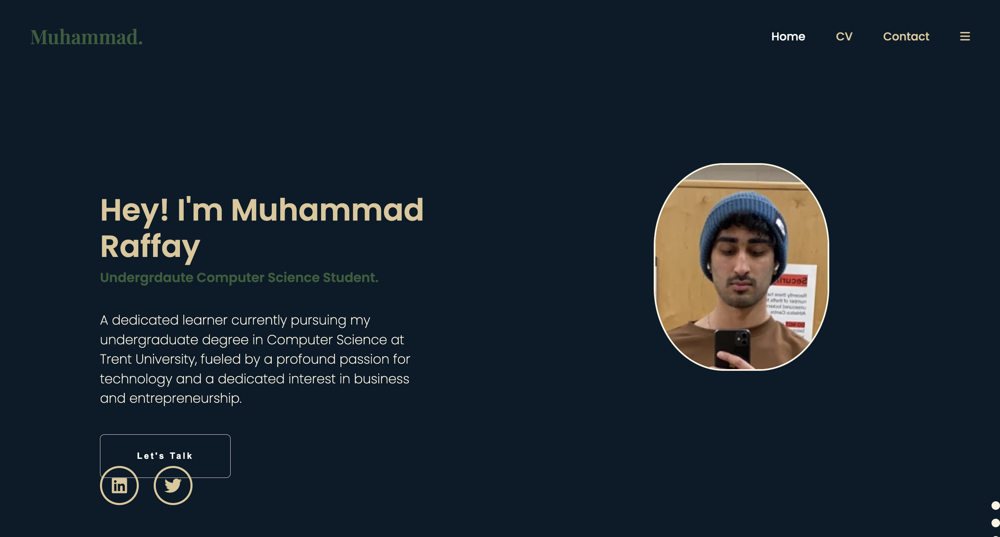
   
   

- Firefox 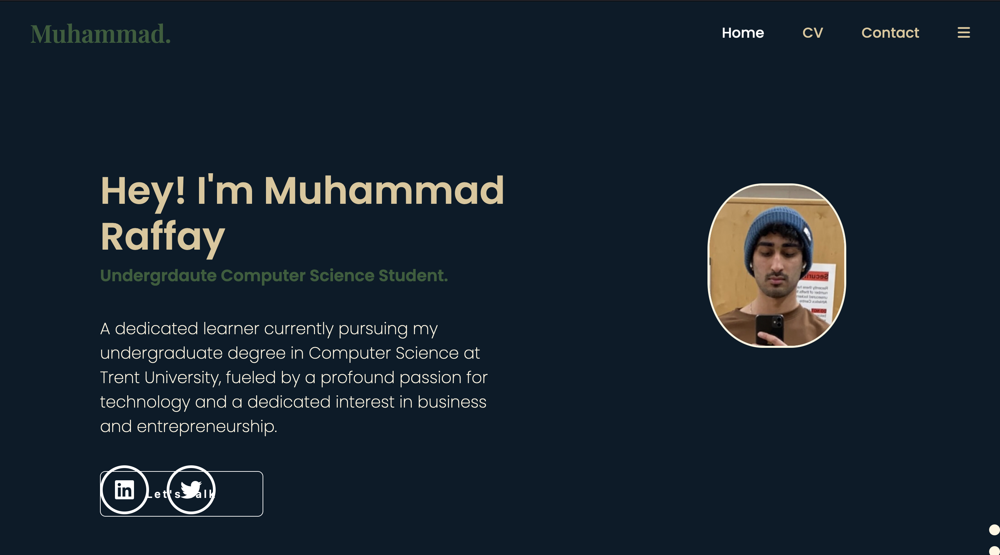
   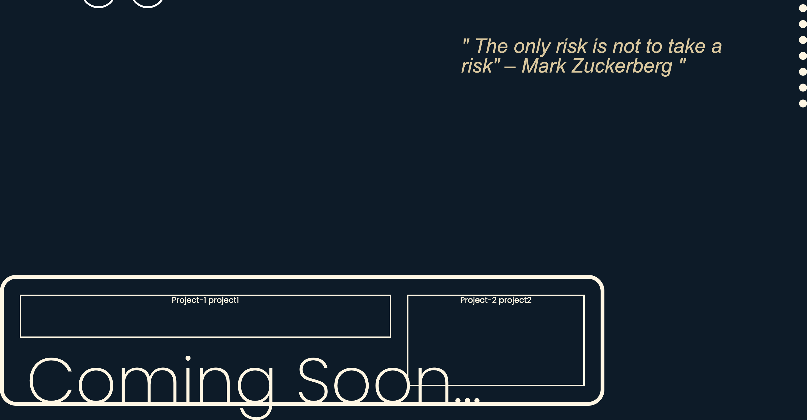
   

- Safari  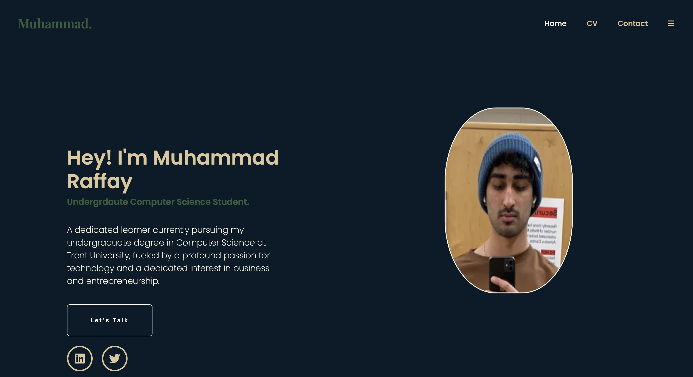
   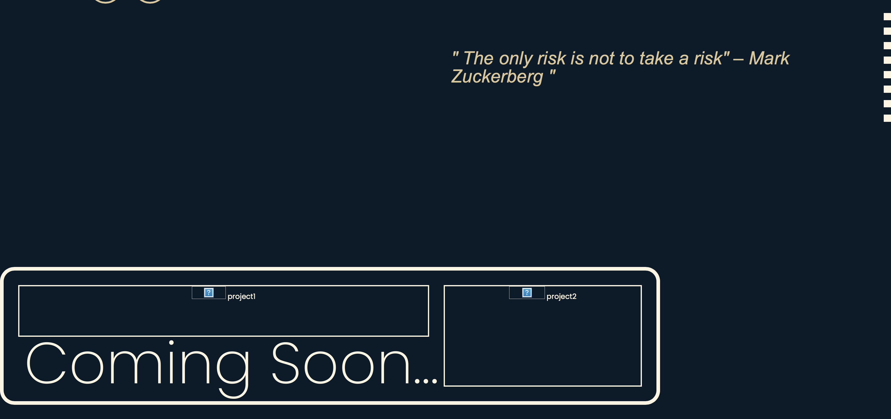
   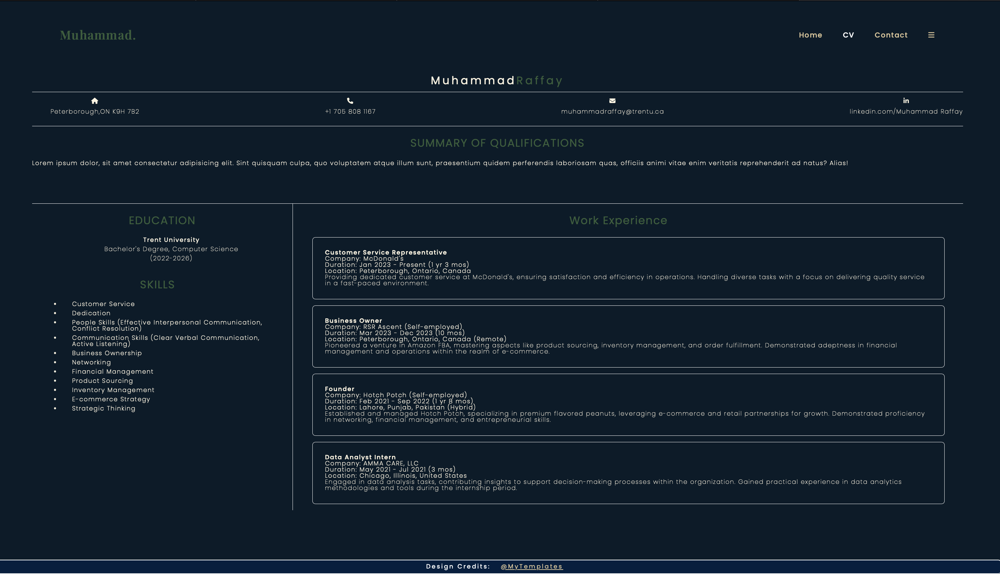

- Brave   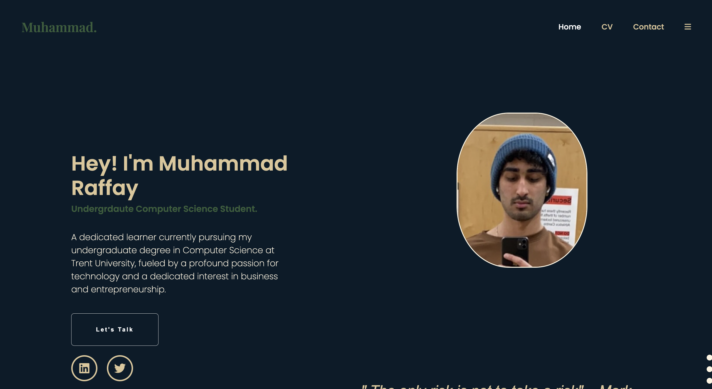
   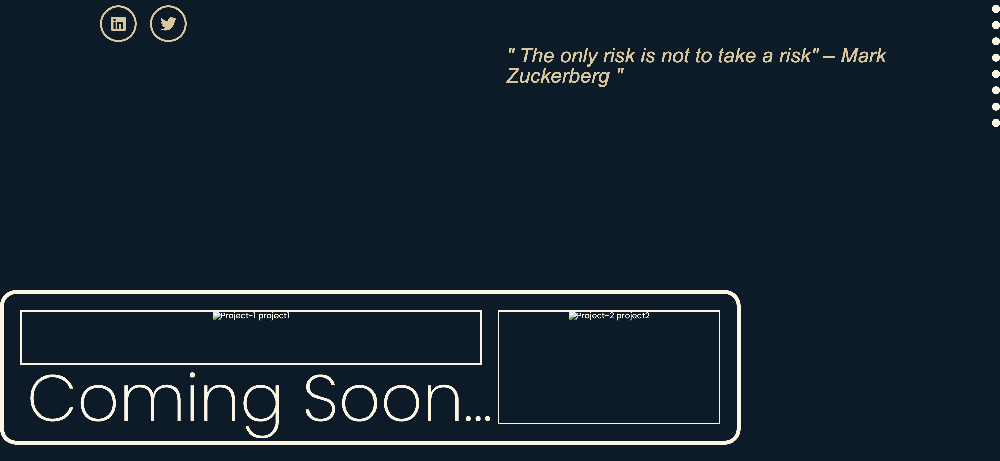
   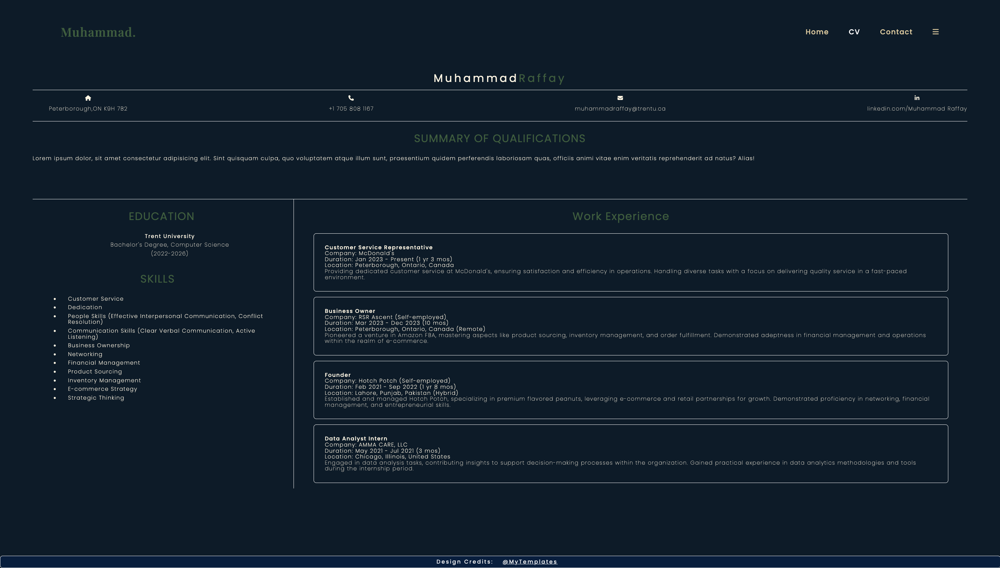

**Platforms** 

-  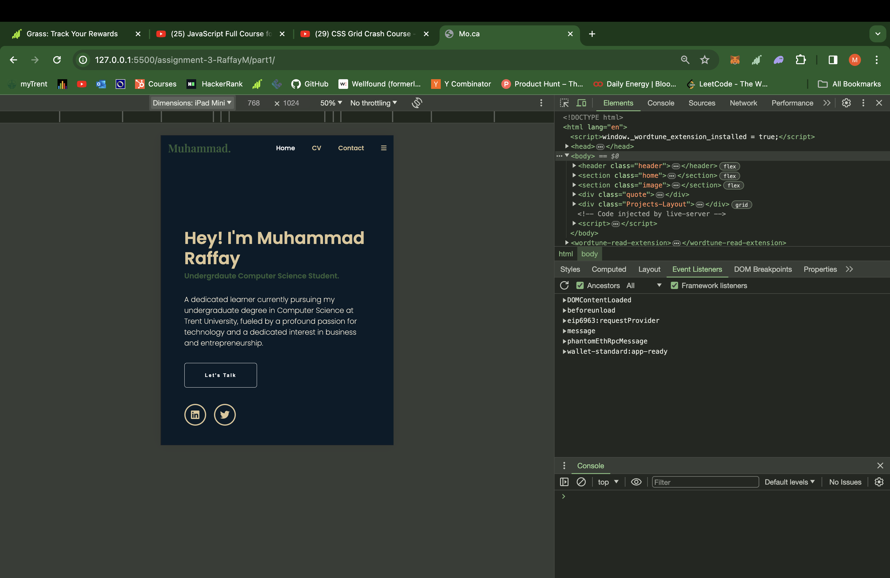
-  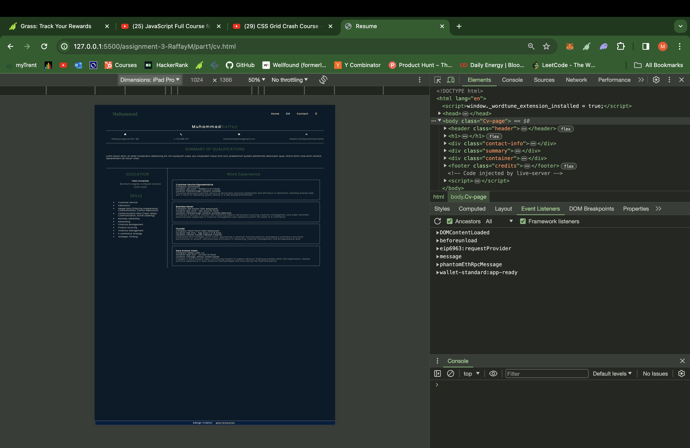

-  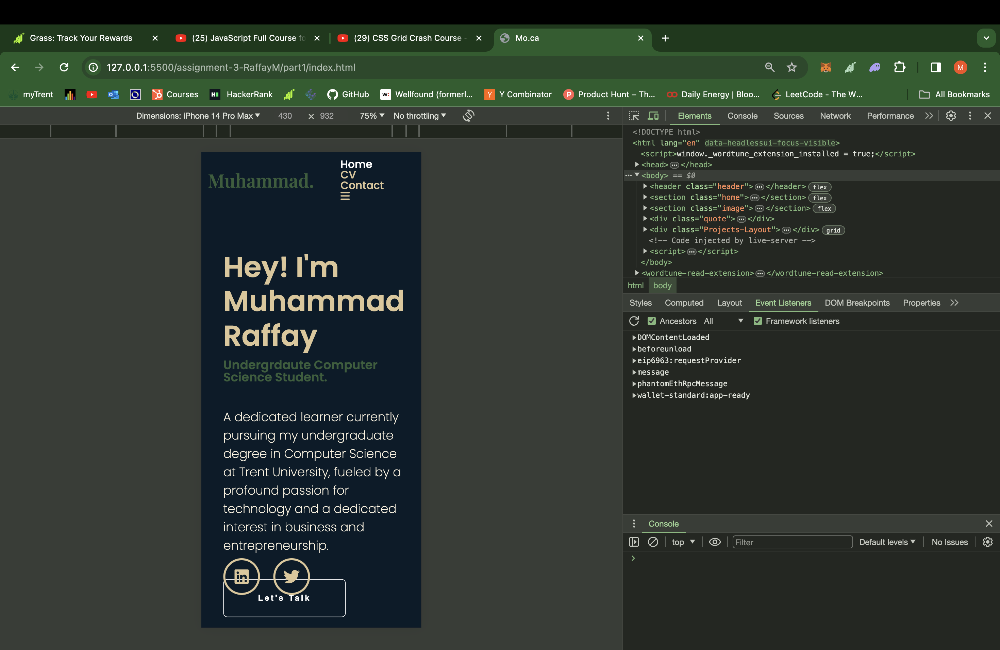

- **HTML Validation**: HTML of both pages was validated using the W3C Markup Validation Service.
- **State Changes Illustration**: State changes like hover effects were illustrated using screenshots.
- **Accessibility Testing**: The website was tested for accessibility using tools like Lighthouse and WAVE.

## HTML Validation Results

### Introduction Page
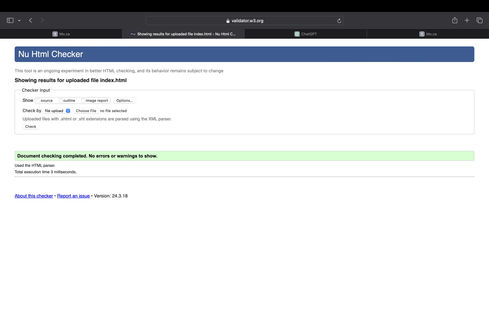

### CV Page
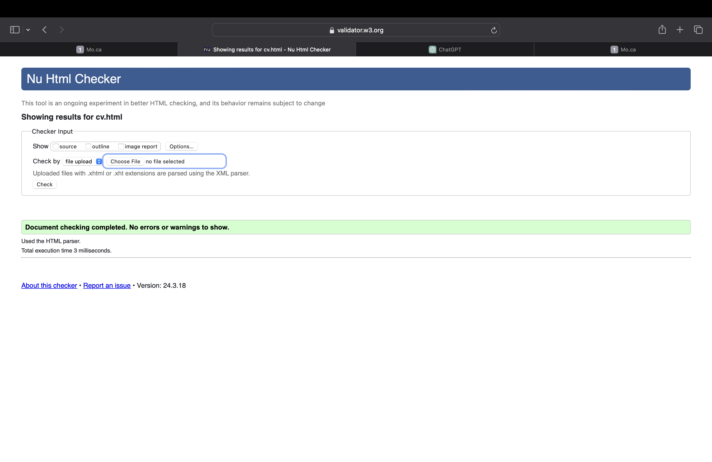

## State Changes Illustration

### Home Page

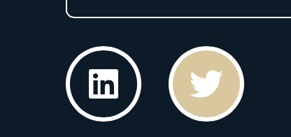

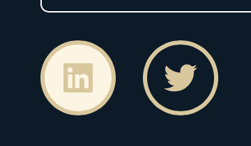

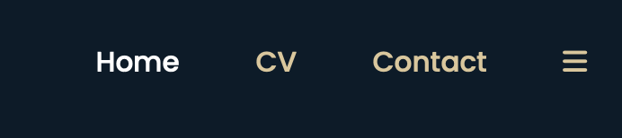
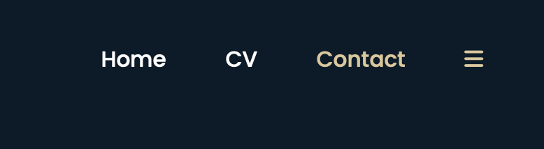

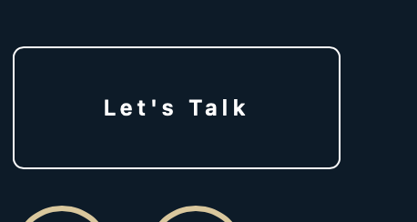
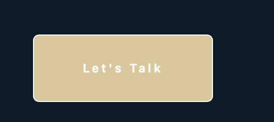

### CV Page
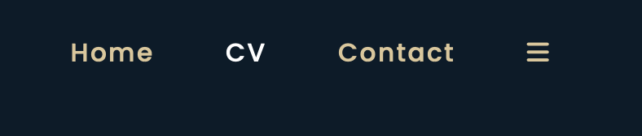
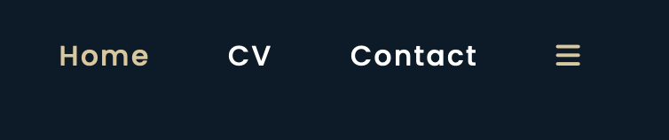

## Accessibility Testing

## Design Credit

The design for the CV page was chosen from: [Dribble Design](https://dribbble.com/shots/15161588-Resume-CV-Template)
